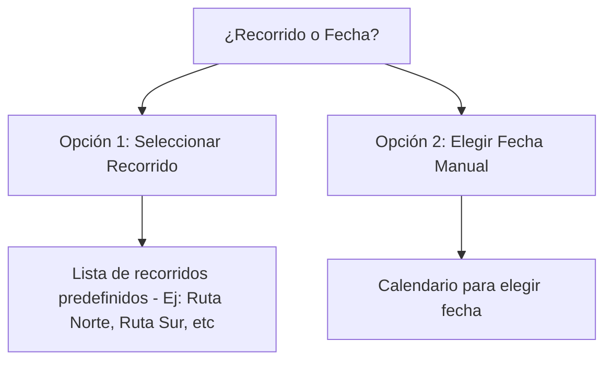
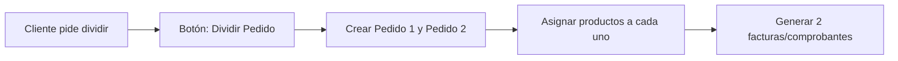
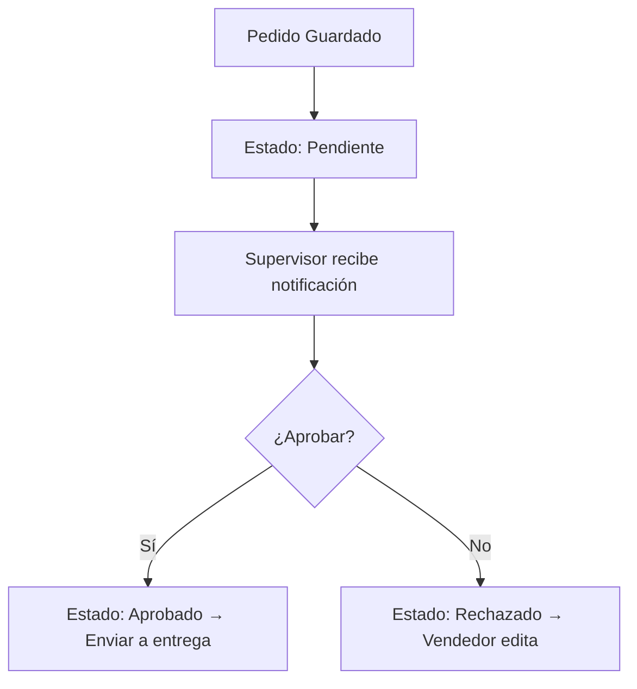

# Flujo de Funcionamiento de una App de Pedidos de Bebidas Gaseosas en Bolivia

A continuación, se detalla el **flujo de funcionamiento** de una **aplicación de pedidos** para bebidas gaseosas en Bolivia, con soporte para recorridos, selección de clientes, división de pedidos, cálculos en bolivianos, pedidos múltiples y validación/aprobación.

---

## 1. **Inicio de Sesión / Registro**
- **Acceso**: El vendedor inicia sesión con usuario/contraseña o biometría.
- **Roles**: Vendedor, Supervisor, Administrador.

---

## 2. **Nuevo Pedido – Pantalla Principal**
- **Botón principal**: `+ NUEVO PEDIDO`.
- Inicia el flujo paso a paso.

---

## 3. **Paso 1: Selección de Recorrido o Fecha de Entrega**

- **Recorrido**: Muestra clientes asignados a la ruta seleccionada.
- **Fecha Manual**: Permite programar una entrega futura.

---

## 4. **Paso 2: Selección de Cliente(s)**
- **Búsqueda rápida**: Por nombre, código o teléfono.
- **Filtro por recorrido**: Si se seleccionó una ruta.
- **Pedidos múltiples**: Opción para seleccionar varios clientes (`Agregar otro cliente`).

---

## 5. **Paso 3: Ingreso de Pedidos (por Cliente)**
### Detalle por cliente:
| Campo | Detalle |
|-------|---------|
| **Producto** | Lista de gaseosas (Coca-Cola, Inka Kola, etc.) |
| **Presentación** | 500ml, 1.5L, 3L, pack x6, etc. |
| **Cantidad** | Input numérico |
| **Precio Unitario** | Automático según lista de precios (Bs.) |
| **Subtotal** | Calculado automáticamente |

- **Botón**: `Agregar otro producto`.

---

## 6. **Paso 4: Cálculos Automáticos (en Bolivianos)**
```
Subtotal = Cantidad × Precio Unitario
Descuento (opcional) = % o monto fijo
Total por cliente = Subtotal - Descuento
```
- **Pedidos múltiples**:
  ```
  Total General = Σ Totales de todos los clientes
  ```

---

## 7. **Paso 5: Dividir Pedido (Opcional – "Partir en 2")**

- Ejemplo:
  - Pedido 1: Entrega hoy.
  - Pedido 2: Entrega en 3 días.

---

## 8. **Paso 6: Pedidos Simultáneos para Varios Clientes**
- **Modo "Pedido Múltiple"**:
  - Crear una **cesta general**.
  - Por cada cliente:
    - Sub-pantalla para ingresar productos.
    - Guardar en pestañas: `Cliente 1 | Cliente 2 | +`.
  - Resumen final: Totales por cliente + **Total General**.

---

## 9. **Paso 7: Resumen del Pedido**
| Cliente | Productos | Cantidad | Total (Bs.) |
|---------|-----------|----------|-------------|
| Juan Pérez | Coca-Cola 1.5L x 6 | 6 | 72.00 |
| María López | Inka Kola 3L x 2 | 2 | 40.00 |
| **TOTAL GENERAL** | | | **112.00** |

- **Botones**:
  - `Editar`
  - `Guardar Borrador`
  - `Enviar a Aprobación`

---

## 10. **Paso 8: Validación y Aprobación**

- Supervisor revisa:
  - Detalle del pedido.
  - Historial de cliente.
  - Deuda pendiente (si aplica).
  - Crédito disponible.

---

## 11. **Paso 9: Generación de Documentos**
- Al aprobarse:
  - **Comprobante de pedido** (PDF o impresión).
  - **Factura electrónica** (si aplica).
  - **Ruta de entrega** actualizada.
  - **Notificación al cliente** (WhatsApp/SMS).

---

## 12. **Paso 10: Entrega y Cierre**
- Chofer/Repartidor recibe la ruta.
- Marca como **Entregado**.
- Cliente firma digitalmente o confirma.
- Pedido pasa a **Cerrado**.

---

## 13. **Funcionalidades Adicionales**
| Función | Descripción |
|---------|-------------|
| **Borradores** | Guardar pedidos sin enviar. |
| **Historial** | Ver pedidos pasados por cliente. |
| **Deudas** | Mostrar saldo pendiente del cliente. |
| **Crédito** | Bloquear si excede límite. |
| **Sincronización Offline** | Funciona sin internet, sube al reconectar. |
| **Reportes** | Ventas diarias, por ruta, por producto. |

---

## 14. **Ejemplo de Flujo Rápido (1 Cliente)**
1. Toca `+ Nuevo Pedido`.
2. Elige `Recorrido: Ruta Sur`.
3. Busca `Juan Pérez`.
4. Agrega:
   - Coca-Cola 1.5L × 6 → 72 Bs.
   - Inka Kola 500ml × 12 → 60 Bs.
5. **Total**: 132 Bs.
6. Toca `Enviar a Aprobación`.
7. Supervisor aprueba → Se genera ruta de entrega.

---

## 15. **Tecnología Sugerida**
- **App móvil**: Flutter o React Native.
- **Backend**: Node.js + PostgreSQL.
- **Offline**: SQLite local + sincronización.
- **Notificaciones**: Firebase / WhatsApp Business API.
- **Impresión**: Bluetooth a impresora térmica.

---

## 16. **Opciones Adicionales**
¿Te interesa que desarrolle alguno de estos elementos?:
- Un **prototipo en Figma**.
- El **diagrama de base de datos**.
- El **flujo en PDF**.
- Un **nombre para la app** (Ej: `GaseoYa`, `PediGas`, `RutaRefrescos`).

¡Avísame y lo trabajamos! 🚀

---

**Fecha actual**: 5 de noviembre de 2025, 08:32 AM (-04).
