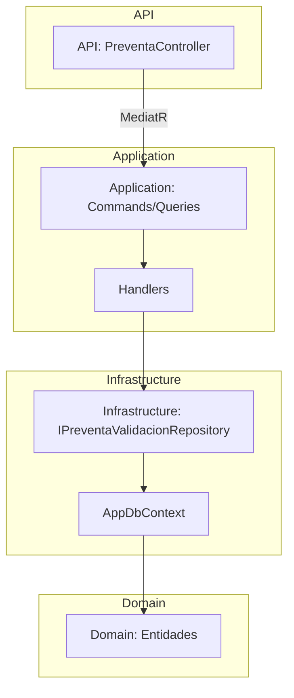
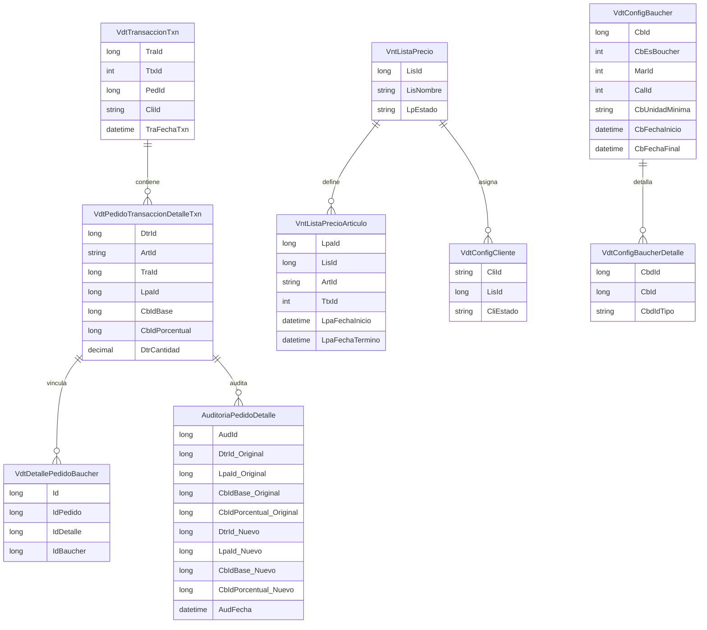
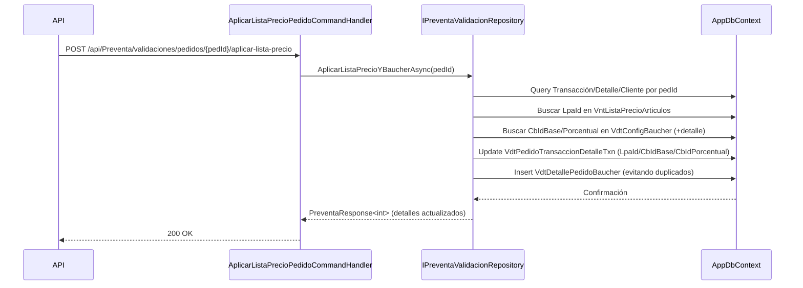
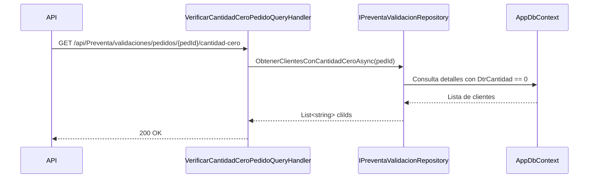
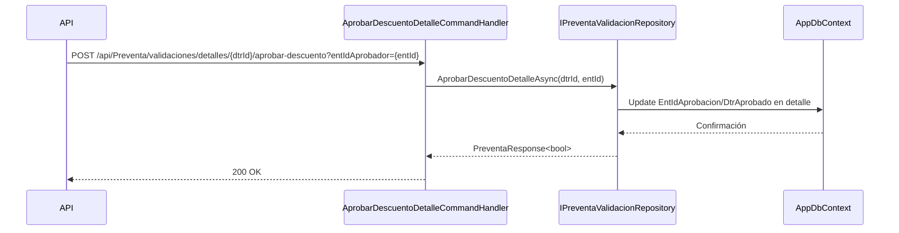
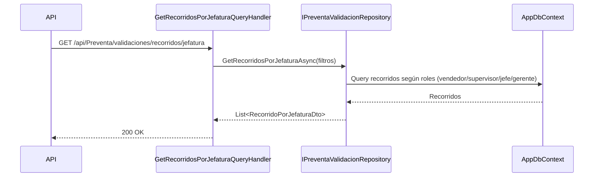

# Módulo de Preventa y Validación

Este documento describe la arquitectura, entidades clave, flujos y endpoints del módulo de Preventa y Validación. Incluye diagramas Mermaid para una visión técnica detallada y profesional.

## Resumen
- Objetivo: asegurar reglas de negocio de preventa (listas de precios, báuchers, campañas, aprobaciones y verificaciones) y exponer endpoints consistentes para validaciones.
- Capas: API (controllers), Application (commands/queries/handlers), Infrastructure (repositories/DbContext), Domain (entities), Shared (wrappers/responses).

## Arquitectura

## Entidades Clave (ER)

## Flujos Principales

### Aplicar Lista de Precios y Báucher a Pedido

### Verificar Cantidad Cero en Pedido

### Aprobar Descuento en Detalle

### Recorridos por Jefatura

## Endpoints
- `GET /api/Preventa/validaciones/usuario/{usrId}`
- `GET /api/Preventa/validaciones/clientes?recId={recId}&pedId={pedId}`
- `GET /api/Preventa/validaciones/recorridos/jefatura` (query: `entIdVendedor`, `entIdSupervisor`, `entIdJefeVentas`, `entIdGerenteVentas`)
- `POST /api/Preventa/validaciones/pedidos/{pedId}/aplicar-lista-precio`
- `GET /api/Preventa/validaciones/pedidos/{pedId}/cantidad-cero`
- `POST /api/Preventa/validaciones/detalles/{dtrId}/aprobar-descuento?entIdAprobador={entId}`

## Consideraciones de Auditoría
- Cambios de `LpaId`, `CbIdBase`, `CbIdPorcentual` pueden ser registrados en `AuditoriaPedidoDetalle` o en el sistema de auditoría (`SgtAuditoriaCambios`) según políticas.
- `VdtDetallePedidoBaucher` asegura trazabilidad del báucher aplicado a un detalle y pedido.

## Buenas Prácticas
- Validar vigencia por fecha al seleccionar `LpaId` y báuchers.
- Evitar duplicados en `VdtDetallePedidoBaucher` al re-aplicar reglas.
- Mantener transacciones unitarias y `SaveChanges` al final del lote.
- Usar `AsNoTracking` en consultas de solo lectura para performance.

## Pruebas sugeridas
- Pedido con lista de precios vigente y sin báucher: espera actualización de `LpaId`.
- Pedido con báucher base y porcentual aplicables: espera actualización de ambos y dos filas en `VdtDetallePedidoBaucher`.
- Pedido con detalles `DtrCantidad == 0`: espera respuesta con `cliIds` correspondientes.
- Aprobación de descuento: confirma `EntIdAprobacion` y `DtrAprobado == true`.

