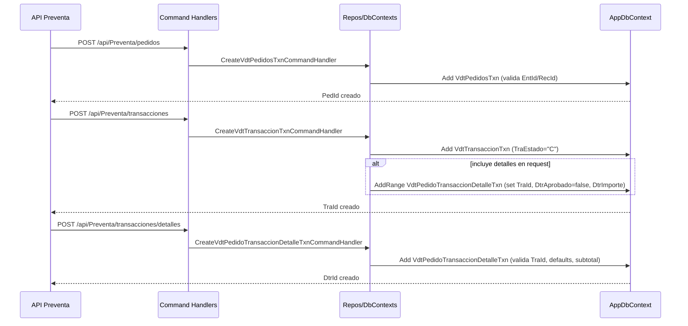

# Módulo de Preventa y Validación


## Resumen
- Objetivo: asegurar reglas de negocio de preventa (listas de precios, báuchers, campañas, aprobaciones y verificaciones) y exponer endpoints consistentes para validaciones.
- Capas: API (controllers), Application (commands/queries/handlers), Infrastructure (repositories/DbContext), Domain (entities), Shared (wrappers/responses).

## Arquitectura


## Entidades Clave (ER)
```mermaid
erDiagram
  VdtTransaccionTxn ||--o{ VdtPedidoTransaccionDetalleTxn : contiene
  VntListaPrecio ||--o{ VntListaPrecioArticulo : define
  VdtConfigBaucher ||--o{ VdtConfigBaucherDetalle : detalla
  VdtPedidoTransaccionDetalleTxn ||--o{ VdtDetallePedidoBaucher : vincula
  VdtPedidoTransaccionDetalleTxn ||--o{ AuditoriaPedidoDetalle : audita
  VntListaPrecio ||--o{ VdtConfigCliente : asigna

  VdtTransaccionTxn {
    long TraId
    int TtxId
    long PedId
    string CliId
    datetime TraFechaTxn
  }

  VdtPedidoTransaccionDetalleTxn {
    long DtrId
    string ArtId
    long TraId
    long LpaId
    long CbIdBase
    long CbIdPorcentual
    decimal DtrCantidad
  }

  VntListaPrecio {
    long LisId
    string LisNombre
    string LpEstado
  }

  VntListaPrecioArticulo {
    long LpaId
    long LisId
    string ArtId
    int TtxId
    datetime LpaFechaInicio
    datetime LpaFechaTermino
  }

  VdtConfigBaucher {
    long CbId
    int CbEsBoucher
    int? MarId
    int? CalId
    string? CbUnidadMinima
    datetime CbFechaInicio
    datetime CbFechaFinal
  }

  VdtConfigBaucherDetalle {
    long CbdId
    long CbId
    string CbdIdTipo
  }

  VdtDetallePedidoBaucher {
    long Id
    long IdPedido
    long IdDetalle
    long IdBaucher
  }

  AuditoriaPedidoDetalle {
    long AudId
    long DtrId_Original
    long LpaId_Original
    long CbIdBase_Original
    long CbIdPorcentual_Original
    long DtrId_Nuevo
    long LpaId_Nuevo
    long CbIdBase_Nuevo
    long CbIdPorcentual_Nuevo
    datetime AudFecha
  }

  VdtConfigCliente {
    string CliId
    long LisId
    string CliEstado
  }
```

## Flujos Principales

### Aplicar Lista de Precios y Báucher a Pedido


### Verificar Cantidad Cero en Pedido


### Aprobar Descuento en Detalle


### Recorridos por Jefatura


## Endpoints

**Validaciones**
- `GET /api/Preventa/validaciones/usuario/{usrId}`
- `GET /api/Preventa/validaciones/clientes?recId={recId}&pedId={pedId}`
- `GET /api/Preventa/validaciones/prestamo?pedId={pedId}&cliId={cliId}&cpeId={cpeId}&artId={artId}&ttxId={ttxId}&cantidadNueva={cantidad}`
- `GET /api/Preventa/validaciones/recorridos/jefatura` (query: `entIdVendedor`, `entIdSupervisor`, `entIdJefeVentas`, `entIdGerenteVentas`)
- `POST /api/Preventa/validaciones/pedidos/{pedId}/aplicar-lista-precio`
- `GET /api/Preventa/validaciones/pedidos/{pedId}/cantidad-cero`
- `POST /api/Preventa/validaciones/detalles/{dtrId}/aprobar-descuento?entIdAprobador={entId}`

**Pedidos**
- `GET /api/Preventa/pedidos` (paginado y filtros)
- `GET /api/Preventa/pedidos/{pedId}`
- `GET /api/Preventa/pedidos/cliente/{cliId}` (paginado)
- `GET /api/Preventa/pedidos/vendedor/{entIdVendedor}` (paginado y rango de fechas)
- `POST /api/Preventa/pedidos` (crea pedido)
- `PUT /api/Preventa/pedidos/{pedId}` (actualiza pedido)
- `DELETE /api/Preventa/pedidos/{pedId}` (elimina pedido)
- `PATCH /api/Preventa/pedidos/{pedId}/estado` (cambia estado)

**Transacciones**
- `GET /api/Preventa/transacciones` (paginado y filtros: `estado`, `fechaDesde`, `fechaHasta`, `cliId`, `entIdVendedor`, `pedId`)
- `GET /api/Preventa/transacciones/{traId}`
- `GET /api/Preventa/transacciones/pedido/{pedId}`
- `POST /api/Preventa/transacciones` (crea transacción)
- `PUT /api/Preventa/transacciones/{traId}` (actualiza transacción)
- `DELETE /api/Preventa/transacciones/{traId}` (elimina transacción)
- `POST /api/Preventa/transacciones/{traId}/procesar` (procesa)
- `POST /api/Preventa/transacciones/{traId}/cancelar` (cancela)

**Detalles de Transacciones**
- `GET /api/Preventa/transacciones/{traId}/detalles`
- `GET /api/Preventa/detalles/{dtrId}`
- `POST /api/Preventa/transacciones/detalles` (crea detalle)
- `POST /api/Preventa/transacciones/{traId}/detalles/bulk` (crea varios detalles)

## Habilitación del Siguiente Paso
- Usuario habilitado: `GET /api/Preventa/validaciones/usuario/{usrId}` retorna `UsuarioElegibleDto` con `Habilitado` y `Estado`. Si `Habilitado == true`, el usuario puede avanzar al siguiente paso (crear pedido/transacción).
- Prestamo/Equivalencia: `GET /api/Preventa/validaciones/prestamo` evalúa reglas de préstamo y equivalencias de tipo de transacción (`TtxId`), condicionando si se puede seguir con el flujo.
- Cantidad cero en pedido: `GET /api/Preventa/validaciones/pedidos/{pedId}/cantidad-cero` devuelve clientes con detalles en cero; el flujo debe bloquear o advertir según políticas.
- Aplicación de reglas comerciales: `POST /api/Preventa/validaciones/pedidos/{pedId}/aplicar-lista-precio` consolida `LpaId`, `CbIdBase`, `CbIdPorcentual` y registra en `VdtDetallePedidoBaucher`. Es recomendable ejecutar antes de procesar la transacción.

## Inserción de Pedido, Transacción y Detalle



**Detalles técnicos (código)**
- Pedido (`CreateVdtPedidosTxnCommandHandler`):
  - Valida existencia de `EntId` y `RecId` vía `IVdtPedidosTxnRepository.ExistsAsync`.
  - Mapea `VdtPedidosTxnCreateDto` a `VdtPedidosTxn`, setea `PedFechaTxn = DateTime.Now`.
  - Persiste con `_pedidoRepo.AddAsync(pedido)` y retorna `PedId`.
- Transacción (`CreateVdtTransaccionTxnCommandHandler`):
  - Valida `PedId` si viene.
  - Mapea a `VdtTransaccionTxn` y setea `TraEstado = "C"` (creada).
  - Persiste con `_repository.AddAsync(transaccion)`.
  - Si `dto.Detalles` viene: mapea a `VdtPedidoTransaccionDetalleTxn`, setea `TraId`, `DtrAprobado = false`, calcula `DtrImporte = DtrCantidad * DtrPrecio` si falta, e inserta con `_detalleRepository.AddRangeAsync`.
- Detalle (`CreateVdtPedidoTransaccionDetalleTxnCommandHandler`):
  - Valida que la transacción exista (`IVdtTransaccionTxnRepository.ExistsAsync`).
  - Mapea `VdtPedidoTransaccionDetalleTxnCreateDto` a entidad.
  - Setea valores por defecto (`DetAprobado/UsuarioCreacion/FechaCreacion`) y subtotal (`Cantidad * PrecioUnitario` según DTO correspondiente).
  - Inserta con `_repository.AddAsync(detalle)` y retorna el identificador.


## Consideraciones de Auditoría
- Cambios de `LpaId`, `CbIdBase`, `CbIdPorcentual` pueden ser registrados en `AuditoriaPedidoDetalle` o en el sistema de auditoría (`SgtAuditoriaCambios`) según políticas.
- `VdtDetallePedidoBaucher` asegura trazabilidad del báucher aplicado a un detalle y pedido.

## Buenas Prácticas
- Validar vigencia por fecha al seleccionar `LpaId` y báuchers.
- Evitar duplicados en `VdtDetallePedidoBaucher` al re-aplicar reglas.
- Mantener transacciones unitarias y `SaveChanges` al final del lote.
- Usar `AsNoTracking` en consultas de solo lectura para performance.

## Pruebas sugeridas
- Pedido con lista de precios vigente y sin báucher: espera actualización de `LpaId`.
- Pedido con báucher base y porcentual aplicables: espera actualización de ambos y dos filas en `VdtDetallePedidoBaucher`.
- Pedido con detalles `DtrCantidad == 0`: espera respuesta con `cliIds` correspondientes.
- Aprobación de descuento: confirma `EntIdAprobacion` y `DtrAprobado == true`.
