# Sistema de Roles y Permisos Escalable

## 📋 Índice
1. [Resumen Ejecutivo](#resumen-ejecutivo)
2. [Arquitectura del Sistema](#arquitectura-del-sistema)
3. [Modelo de Datos](#modelo-de-datos)
4. [Flujos de Operación](#flujos-de-operación)
5. [Casos de Uso](#casos-de-uso)
6. [Escalabilidad](#escalabilidad)
7. [Seguridad](#seguridad)
8. [Implementación](#implementación)

---

## 🎯 Resumen Ejecutivo

### Problema
El sistema actual cuenta con ~200 tablas y requiere un control granular de accesos que permita:
- Asignar permisos específicos (lectura, escritura, eliminación, exportación)
- Crear roles flexibles y reutilizables
- Gestionar usuarios externos (auditores, consultores) con accesos limitados
- Escalar sin impactar rendimiento

### Solución Propuesta
Implementación de un sistema RBAC (Role-Based Access Control) con las siguientes características:

| Característica | Beneficio |
|----------------|-----------|
| **Granularidad Modular** | Control por módulo y acción (usuarios.crear, productos.leer) |
| **Herencia de Permisos** | Un usuario hereda permisos de sus roles |
| **Permisos Directos** | Capacidad de conceder/denegar permisos específicos a usuarios |
| **Roles Temporales** | Asignación de roles con fecha de expiración |
| **Auditoría Completa** | Registro de todos los cambios de permisos |
| **Alta Performance** | Cache de permisos en memoria |

---

## 🏗️ Arquitectura del Sistema

### Diagrama de Arquitectura General

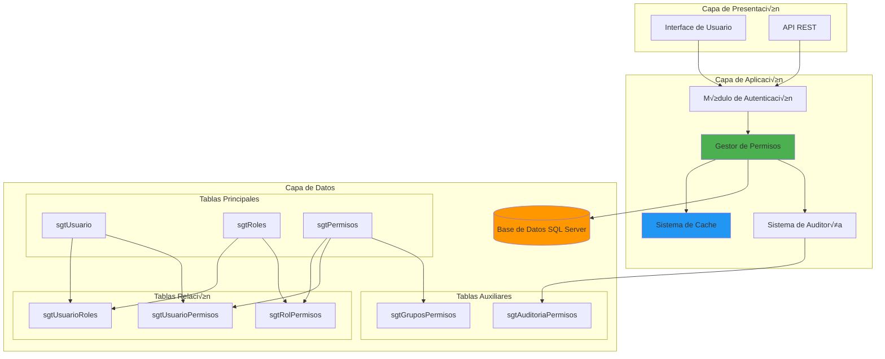
```mermaid
graph TB
    subgraph "Capa de Presentación"
        UI[Interface de Usuario]
        API[API REST]
    end
    
    subgraph "Capa de Aplicación"
        AUTH[Módulo de Autenticación]
        PERM[Gestor de Permisos]
        CACHE[Sistema de Cache]
        AUDIT[Sistema de Auditoría]
    end
    
    subgraph "Capa de Datos"
        DB[(Base de Datos SQL Server)]
        
        subgraph "Tablas Principales"
            USR[sgtUsuario]
            ROL[sgtRoles]
            PRM[sgtPermisos]
        end
        
        subgraph "Tablas Relación"
            USRROL[sgtUsuarioRoles]
            ROLPRM[sgtRolPermisos]
            USRPRM[sgtUsuarioPermisos]
        end
        
        subgraph "Tablas Auxiliares"
            GRP[sgtGruposPermisos]
            AUD[sgtAuditoriaPermisos]
        end
    end
    
    UI --> AUTH
    API --> AUTH
    AUTH --> PERM
    PERM --> CACHE
    PERM --> DB
    PERM --> AUDIT
    AUDIT --> AUD
    
    USR --> USRROL
    ROL --> USRROL
    ROL --> ROLPRM
    PRM --> ROLPRM
    USR --> USRPRM
    PRM --> USRPRM
    PRM --> GRP
    
    style PERM fill:#4CAF50
    style CACHE fill:#2196F3
    style DB fill:#FF9800
```

### Modelo de Permisos

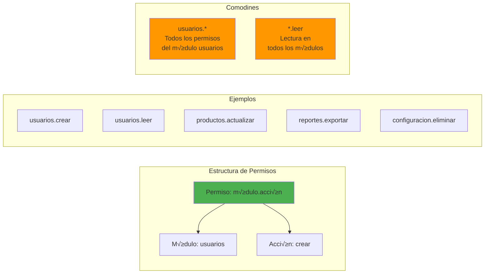
```mermaid
graph LR
    subgraph "Estructura de Permisos"
        P[Permiso: módulo.acción]
        P --> M[Módulo: usuarios]
        P --> A[Acción: crear]
    end
    
    subgraph "Ejemplos"
        E1[usuarios.crear]
        E2[usuarios.leer]
        E3[productos.actualizar]
        E4[reportes.exportar]
        E5[configuracion.eliminar]
    end
    
    subgraph "Comodines"
        W1[usuarios.*<br/>Todos los permisos<br/>del módulo usuarios]
        W2[*.leer<br/>Lectura en<br/>todos los módulos]
    end
    
    style P fill:#4CAF50
    style W1 fill:#FF9800
    style W2 fill:#FF9800
```

---

## üíæ Modelo de Datos

### Diagrama Entidad-Relación

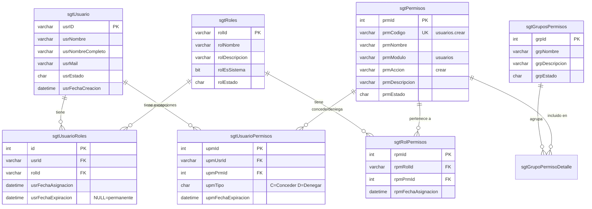
```mermaid
erDiagram
    sgtUsuario ||--o{ sgtUsuarioRoles : "tiene"
    sgtRoles ||--o{ sgtUsuarioRoles : "asignado a"
    sgtRoles ||--o{ sgtRolPermisos : "tiene"
    sgtPermisos ||--o{ sgtRolPermisos : "pertenece a"
    sgtUsuario ||--o{ sgtUsuarioPermisos : "tiene excepciones"
    sgtPermisos ||--o{ sgtUsuarioPermisos : "concede/deniega"
    sgtGruposPermisos ||--o{ sgtGrupoPermisoDetalle : "agrupa"
    sgtPermisos ||--o{ sgtGrupoPermisoDetalle : "incluido en"
    
    sgtUsuario {
        varchar usrID PK
        varchar usrNombre
        varchar usrNombreCompleto
        varchar usrMail
        char usrEstado
        datetime usrFechaCreacion
    }
    
    sgtRoles {
        varchar rolId PK
        varchar rolNombre
        varchar rolDescripcion
        bit rolEsSistema
        char rolEstado
    }
    
    sgtPermisos {
        int prmId PK
        varchar prmCodigo UK "usuarios.crear"
        varchar prmNombre
        varchar prmModulo "usuarios"
        varchar prmAccion "crear"
        varchar prmDescripcion
        char prmEstado
    }
    
    sgtUsuarioRoles {
        int id PK
        varchar usrId FK
        varchar rolId FK
        datetime usrFechaAsignacion
        datetime usrFechaExpiracion "NULL=permanente"
    }
    
    sgtRolPermisos {
        int rpmId PK
        varchar rpmRolId FK
        int rpmPrmId FK
        datetime rpmFechaAsignacion
    }
    
    sgtUsuarioPermisos {
        int upmId PK
        varchar upmUsrId FK
        int upmPrmId FK
        char upmTipo "C=Conceder D=Denegar"
        datetime upmFechaExpiracion
    }
    
    sgtGruposPermisos {
        int grpId PK
        varchar grpNombre
        varchar grpDescripcion
        char grpEstado
    }
```

### Ejemplo de Datos

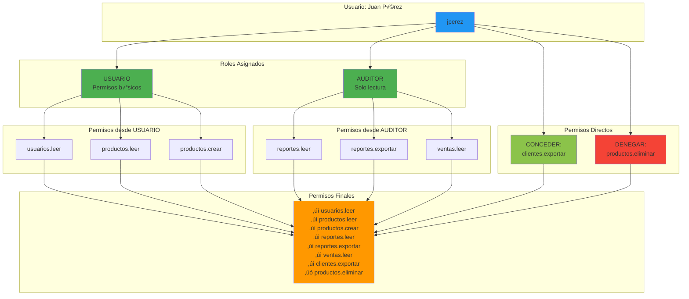
```mermaid
graph TD
    subgraph "Usuario: Juan Pérez"
        U1[jperez]
    end
    
    subgraph "Roles Asignados"
        R1[USUARIO<br/>Permisos b√°sicos]
        R2[AUDITOR<br/>Solo lectura]
    end
    
    subgraph "Permisos desde USUARIO"
        P1[usuarios.leer]
        P2[productos.leer]
        P3[productos.crear]
    end
    
    subgraph "Permisos desde AUDITOR"
        P4[reportes.leer]
        P5[reportes.exportar]
        P6[ventas.leer]
    end
    
    subgraph "Permisos Directos"
        P7[CONCEDER:<br/>clientes.exportar]
        P8[DENEGAR:<br/>productos.eliminar]
    end
    
    subgraph "Permisos Finales"
        PF[‚úì usuarios.leer<br/>‚úì productos.leer<br/>‚úì productos.crear<br/>‚úì reportes.leer<br/>‚úì reportes.exportar<br/>‚úì ventas.leer<br/>‚úì clientes.exportar<br/>‚úó productos.eliminar]
    end
    
    U1 --> R1
    U1 --> R2
    R1 --> P1
    R1 --> P2
    R1 --> P3
    R2 --> P4
    R2 --> P5
    R2 --> P6
    U1 --> P7
    U1 --> P8
    
    P1 --> PF
    P2 --> PF
    P3 --> PF
    P4 --> PF
    P5 --> PF
    P6 --> PF
    P7 --> PF
    P8 --> PF
    
    style U1 fill:#2196F3
    style R1 fill:#4CAF50
    style R2 fill:#4CAF50
    style P7 fill:#8BC34A
    style P8 fill:#F44336
    style PF fill:#FF9800
```

---

## 🔄 Flujos de Operación

### Flujo de Verificación de Permisos

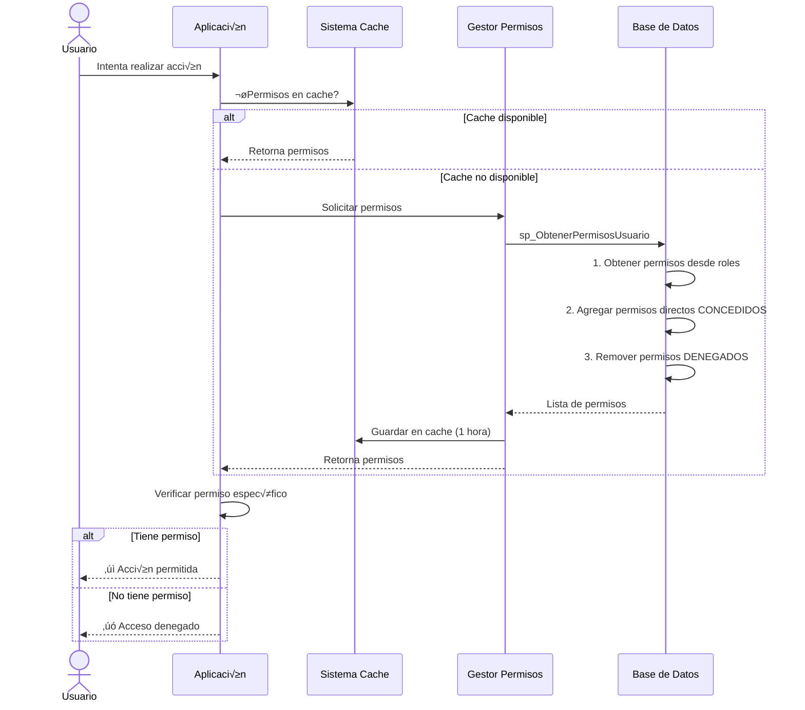
```mermaid
sequenceDiagram
    actor Usuario
    participant App as Aplicación
    participant Cache as Sistema Cache
    participant Auth as Gestor Permisos
    participant DB as Base de Datos
    
    Usuario->>App: Intenta realizar acción
    App->>Cache: ¬øPermisos en cache?
    
    alt Cache disponible
        Cache-->>App: Retorna permisos
    else Cache no disponible
        App->>Auth: Solicitar permisos
        Auth->>DB: sp_ObtenerPermisosUsuario
        
        DB->>DB: 1. Obtener permisos desde roles
        DB->>DB: 2. Agregar permisos directos CONCEDIDOS
        DB->>DB: 3. Remover permisos DENEGADOS
        
        DB-->>Auth: Lista de permisos
        Auth->>Cache: Guardar en cache (1 hora)
        Auth-->>App: Retorna permisos
    end
    
    App->>App: Verificar permiso específico
    
    alt Tiene permiso
        App-->>Usuario: ✓ Acción permitida
    else No tiene permiso
        App-->>Usuario: ‚úó Acceso denegado
    end
```

### Flujo de Asignación de Permisos a Rol

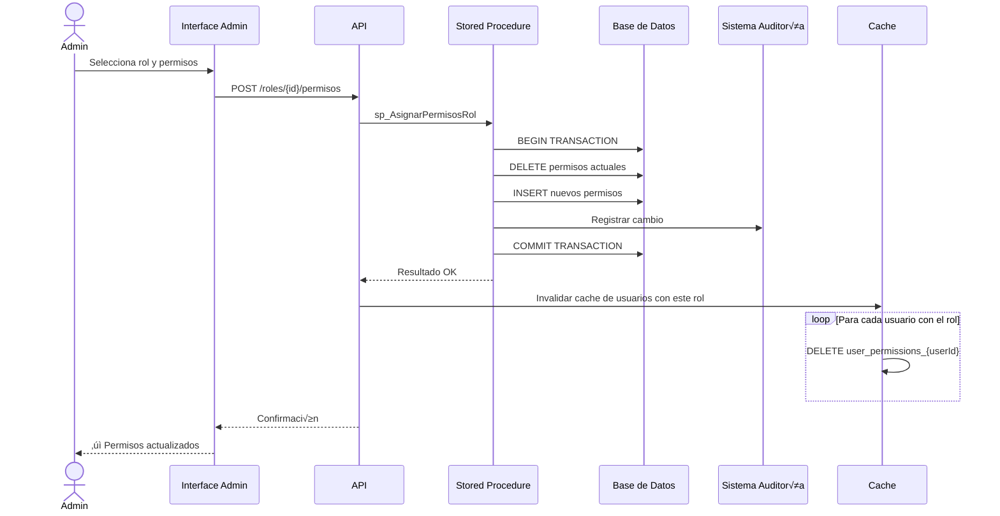
```mermaid
sequenceDiagram
    actor Admin
    participant UI as Interface Admin
    participant API as API
    participant SP as Stored Procedure
    participant DB as Base de Datos
    participant Audit as Sistema Auditoría
    participant Cache as Cache
    
    Admin->>UI: Selecciona rol y permisos
    UI->>API: POST /roles/{id}/permisos
    API->>SP: sp_AsignarPermisosRol
    
    SP->>DB: BEGIN TRANSACTION
    SP->>DB: DELETE permisos actuales
    SP->>DB: INSERT nuevos permisos
    SP->>Audit: Registrar cambio
    SP->>DB: COMMIT TRANSACTION
    
    SP-->>API: Resultado OK
    
    API->>Cache: Invalidar cache de usuarios con este rol
    
    loop Para cada usuario con el rol
        Cache->>Cache: DELETE user_permissions_{userId}
    end
    
    API-->>UI: Confirmación
    UI-->>Admin: ‚úì Permisos actualizados
```

### Flujo de Autenticación y Carga de Permisos

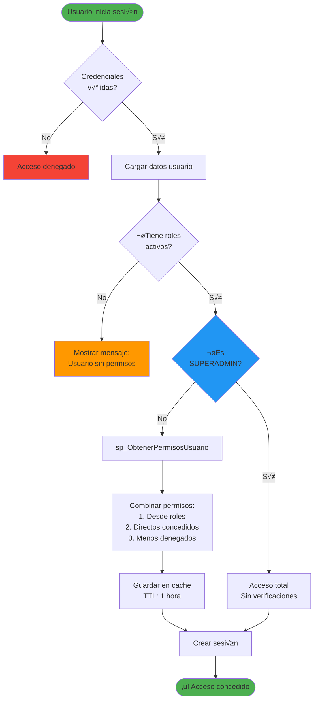
```mermaid
flowchart TD
    Start([Usuario inicia sesión]) --> Auth{Credenciales<br/>válidas?}
    
    Auth -->|No| Fail[Acceso denegado]
    Auth -->|Sí| LoadUser[Cargar datos usuario]
    
    LoadUser --> CheckRoles{¬øTiene roles<br/>activos?}
    
    CheckRoles -->|No| NoRoles[Mostrar mensaje:<br/>Usuario sin permisos]
    CheckRoles -->|Sí| SuperAdmin{¿Es<br/>SUPERADMIN?}
    
    SuperAdmin -->|Sí| AllPerms[Acceso total<br/>Sin verificaciones]
    SuperAdmin -->|No| LoadPerms[sp_ObtenerPermisosUsuario]
    
    LoadPerms --> CombinePerms[Combinar permisos:<br/>1. Desde roles<br/>2. Directos concedidos<br/>3. Menos denegados]
    
    CombinePerms --> CachePerms[Guardar en cache<br/>TTL: 1 hora]
    
    CachePerms --> CreateSession[Crear sesión]
    AllPerms --> CreateSession
    
    CreateSession --> Success([‚úì Acceso concedido])
    
    style Start fill:#4CAF50
    style Success fill:#4CAF50
    style Fail fill:#F44336
    style NoRoles fill:#FF9800
    style SuperAdmin fill:#2196F3
```

---

## üì± Casos de Uso

### Caso 1: Usuario Est√°ndar

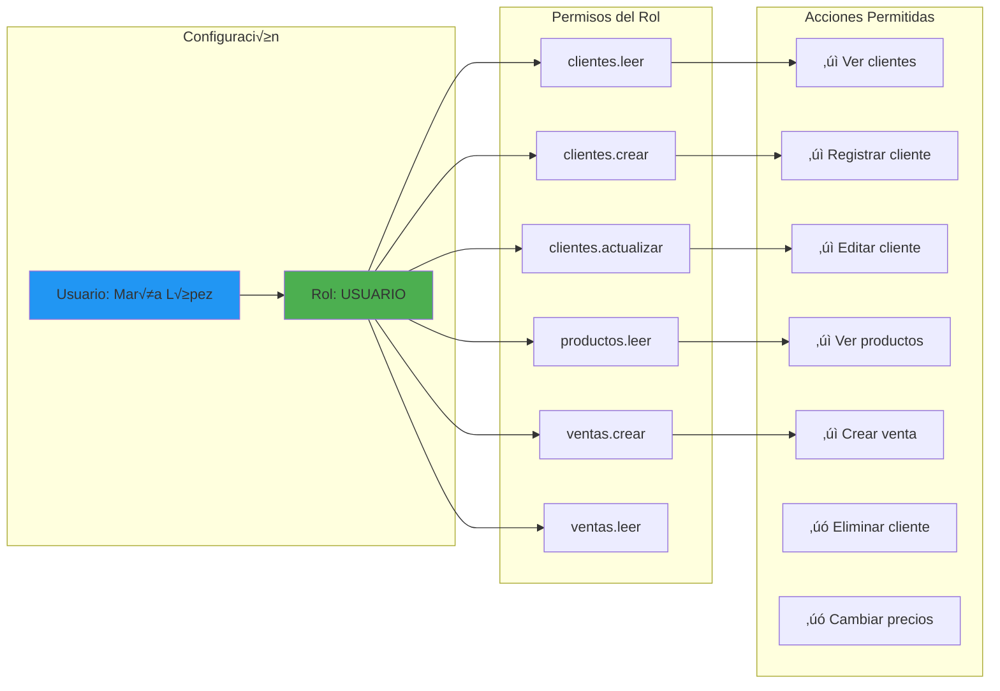
```mermaid
graph LR
    subgraph "Configuración"
        U[Usuario: María López]
        R[Rol: USUARIO]
    end
    
    subgraph "Permisos del Rol"
        P1[clientes.leer]
        P2[clientes.crear]
        P3[clientes.actualizar]
        P4[productos.leer]
        P5[ventas.crear]
        P6[ventas.leer]
    end
    
    subgraph "Acciones Permitidas"
        A1[‚úì Ver clientes]
        A2[‚úì Registrar cliente]
        A3[‚úì Editar cliente]
        A4[‚úì Ver productos]
        A5[‚úì Crear venta]
        A6[‚úó Eliminar cliente]
        A7[‚úó Cambiar precios]
    end
    
    U --> R
    R --> P1 & P2 & P3 & P4 & P5 & P6
    P1 --> A1
    P2 --> A2
    P3 --> A3
    P4 --> A4
    P5 --> A5
    
    style U fill:#2196F3
    style R fill:#4CAF50
```

### Caso 2: Auditor Externo Temporal

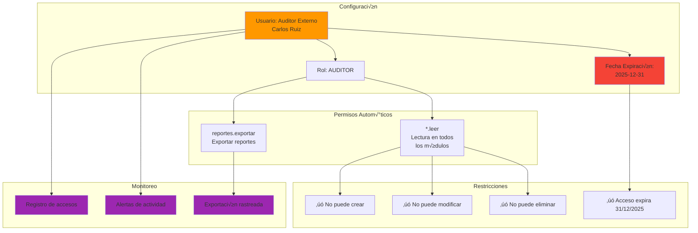
```mermaid
graph TB
    subgraph "Configuración"
        U[Usuario: Auditor Externo<br/>Carlos Ruiz]
        R[Rol: AUDITOR]
        EXP[Fecha Expiración:<br/>2025-12-31]
    end
    
    subgraph "Permisos Autom√°ticos"
        P1[*.leer<br/>Lectura en todos<br/>los módulos]
        P2[reportes.exportar<br/>Exportar reportes]
    end
    
    subgraph "Restricciones"
        R1[‚úó No puede crear]
        R2[‚úó No puede modificar]
        R3[‚úó No puede eliminar]
        R4[‚úó Acceso expira 31/12/2025]
    end
    
    subgraph "Monitoreo"
        M1[Registro de accesos]
        M2[Alertas de actividad]
        M3[Exportación rastreada]
    end
    
    U --> R
    U --> EXP
    R --> P1 & P2
    EXP --> R4
    P1 --> R1 & R2 & R3
    U --> M1 & M2
    P2 --> M3
    
    style U fill:#FF9800
    style EXP fill:#F44336
    style M1 fill:#9C27B0
    style M2 fill:#9C27B0
    style M3 fill:#9C27B0
```

### Caso 3: Administrador con Excepción

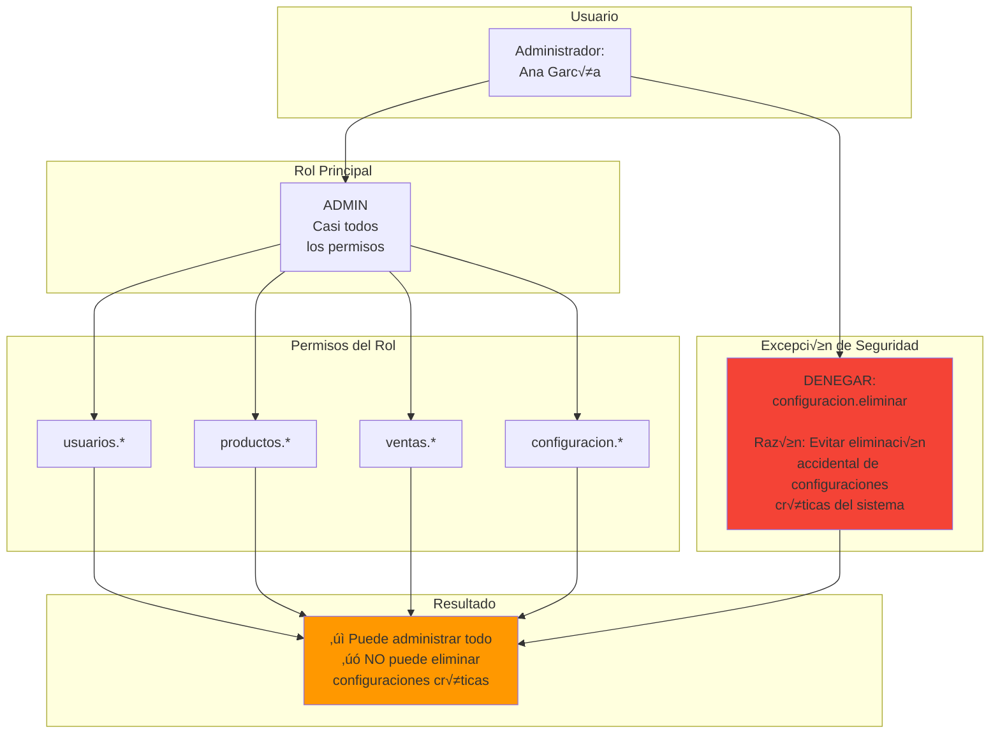
```mermaid
graph TB
    subgraph "Usuario"
        U[Administrador:<br/>Ana García]
    end
    
    subgraph "Rol Principal"
        R[ADMIN<br/>Casi todos<br/>los permisos]
    end
    
    subgraph "Permisos del Rol"
        P1[usuarios.*]
        P2[productos.*]
        P3[ventas.*]
        P4[configuracion.*]
    end
    
    subgraph "Excepción de Seguridad"
        E[DENEGAR:<br/>configuracion.eliminar<br/><br/>Razón: Evitar eliminación<br/>accidental de configuraciones<br/>críticas del sistema]
    end
    
    subgraph "Resultado"
        RES[✓ Puede administrar todo<br/>✗ NO puede eliminar<br/>configuraciones críticas]
    end
    
    U --> R
    U --> E
    R --> P1 & P2 & P3 & P4
    P1 & P2 & P3 & P4 --> RES
    E --> RES
    
    style E fill:#F44336
    style RES fill:#FF9800
```

---

## üìà Escalabilidad

### Estrategias de Optimización

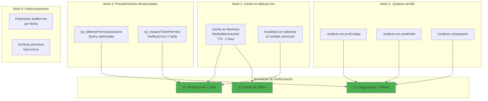
```mermaid
graph TD
    subgraph "Nivel 1: Cache en Aplicación"
        C1[Cache en Memoria<br/>Redis/Memcached<br/>TTL: 1 hora]
        C2[Invalidación selectiva<br/>al cambiar permisos]
    end
    
    subgraph "Nivel 2: Índices de BD"
        I1[Índices en prmCodigo]
        I2[Índices en usrId/rolId]
        I3[Índices compuestos]
    end
    
    subgraph "Nivel 3: Procedimientos Almacenados"
        SP1[sp_ObtenerPermisosUsuario<br/>Query optimizada]
        SP2[sp_UsuarioTienePermiso<br/>Verificación rápida]
    end
    
    subgraph "Nivel 4: Particionamiento"
        P1[Particionar auditoría<br/>por fecha]
        P2[Archivar permisos<br/>históricos]
    end
    
    subgraph "Métricas de Performance"
        M1[⚡ Verificación: < 5ms]
        M2[‚ö° Carga inicial: < 100ms]
        M3[‚ö° Cache hit: 95%+]
    end
    
    C1 --> M1
    C2 --> M1
    SP1 --> M2
    SP2 --> M1
    I1 & I2 & I3 --> M2
    C1 --> M3
    
    style M1 fill:#4CAF50
    style M2 fill:#4CAF50
    style M3 fill:#4CAF50
```

### Capacidad del Sistema

| Métrica | Actual | Con Optimización | Escalabilidad |
|---------|--------|------------------|---------------|
| **Usuarios Concurrentes** | 100 | 10,000+ | Cache + Load Balancing |
| **Tablas Soportadas** | 200 | 1,000+ | Nomenclatura modular |
| **Permisos por Usuario** | 50 | 500+ | Cache eficiente |
| **Tiempo Verificación** | 50ms | < 5ms | Cache + índices |
| **Roles Configurables** | 10 | Ilimitado | Diseño flexible |

---

## üîí Seguridad

### Capas de Seguridad

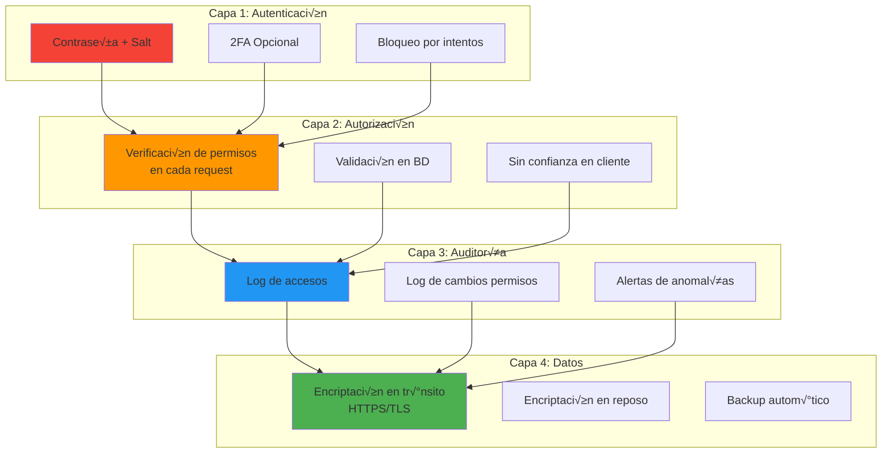
```mermaid
graph TB
    subgraph "Capa 1: Autenticación"
        A1[Contraseña + Salt]
        A2[2FA Opcional]
        A3[Bloqueo por intentos]
    end
    
    subgraph "Capa 2: Autorización"
        B1[Verificación de permisos<br/>en cada request]
        B2[Validación en BD]
        B3[Sin confianza en cliente]
    end
    
    subgraph "Capa 3: Auditoría"
        C1[Log de accesos]
        C2[Log de cambios permisos]
        C3[Alertas de anomalías]
    end
    
    subgraph "Capa 4: Datos"
        D1[Encriptación en tránsito<br/>HTTPS/TLS]
        D2[Encriptación en reposo]
        D3[Backup autom√°tico]
    end
    
    A1 & A2 & A3 --> B1
    B1 & B2 & B3 --> C1
    C1 & C2 & C3 --> D1
    
    style A1 fill:#F44336
    style B1 fill:#FF9800
    style C1 fill:#2196F3
    style D1 fill:#4CAF50
```

### Principios de Seguridad

1. **Menor Privilegio**: Los usuarios solo tienen permisos necesarios
2. **Separación de Funciones**: Roles bien definidos sin solapamiento
3. **Defensa en Profundidad**: Múltiples capas de validación
4. **Auditoría Completa**: Todo cambio queda registrado
5. **Expiración Temporal**: Roles sensibles con fecha de vencimiento

---

## 🚀 Implementación

### Fases del Proyecto

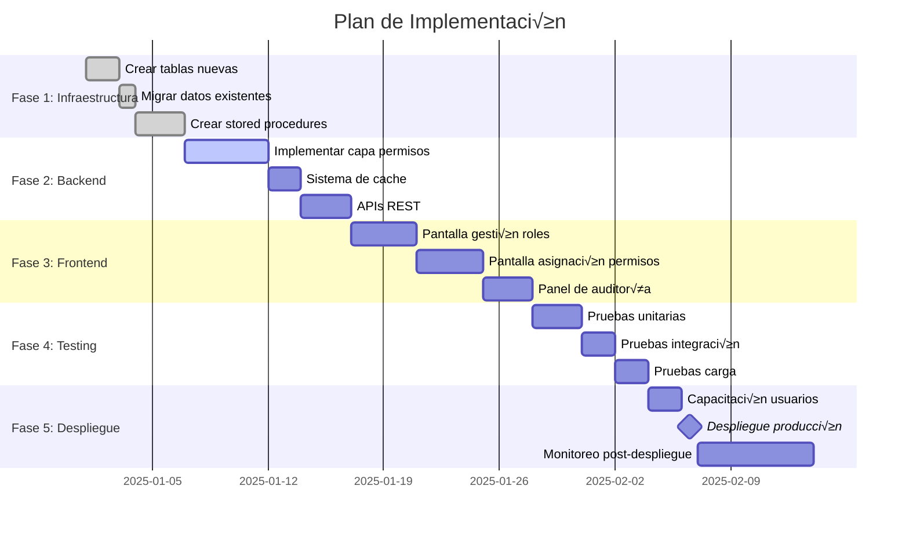
```mermaid
gantt
    title Plan de Implementación
    dateFormat YYYY-MM-DD
    section Fase 1: Infraestructura
    Crear tablas nuevas           :done, f1a, 2025-01-01, 2d
    Migrar datos existentes        :done, f1b, after f1a, 1d
    Crear stored procedures        :done, f1c, after f1b, 3d
    
    section Fase 2: Backend
    Implementar capa permisos      :active, f2a, after f1c, 5d
    Sistema de cache               :f2b, after f2a, 2d
    APIs REST                      :f2c, after f2b, 3d
    
    section Fase 3: Frontend
    Pantalla gestión roles         :f3a, after f2c, 4d
    Pantalla asignación permisos   :f3b, after f3a, 4d
    Panel de auditoría             :f3c, after f3b, 3d
    
    section Fase 4: Testing
    Pruebas unitarias              :f4a, after f3c, 3d
    Pruebas integración            :f4b, after f4a, 2d
    Pruebas carga                  :f4c, after f4b, 2d
    
    section Fase 5: Despliegue
    Capacitación usuarios          :f5a, after f4c, 2d
    Despliegue producción          :milestone, f5b, after f5a, 1d
    Monitoreo post-despliegue      :f5c, after f5b, 7d
```

### Checklist de Implementación

#### ✅ Fase 1: Base de Datos (3 días)
- [ ] Crear tabla `sgtPermisos`
- [ ] Crear tabla `sgtRolPermisos`
- [ ] Crear tabla `sgtUsuarioPermisos`
- [ ] Crear tabla `sgtGruposPermisos`
- [ ] Crear tabla `sgtAuditoriaPermisos`
- [ ] Modificar tabla `sgtRoles` (agregar campos)
- [ ] Modificar tabla `sgtUsuarioRoles` (agregar campos)
- [ ] Crear índices necesarios
- [ ] Poblar permisos base (200 módulos)
- [ ] Crear roles del sistema

#### ✅ Fase 2: Stored Procedures (3 días)
- [ ] `sp_ObtenerPermisosUsuario`
- [ ] `sp_UsuarioTienePermiso`
- [ ] `sp_AsignarPermisosRol`
- [ ] `sp_GenerarPermisosModulos`
- [ ] `sp_ListarPermisosPorModulo`
- [ ] Función `fn_UsuarioTienePermiso`
- [ ] Triggers de auditoría

#### ✅ Fase 3: Backend (10 días)
- [ ] Clase/Servicio `PermissionManager`
- [ ] Middleware de autenticación
- [ ] Middleware de autorización
- [ ] Sistema de cache (Redis)
- [ ] APIs CRUD de roles
- [ ] APIs CRUD de permisos
- [ ] APIs de asignación
- [ ] Endpoints de auditoría

#### ✅ Fase 4: Frontend (11 días)
- [ ] Pantalla: Lista de roles
- [ ] Pantalla: Crear/editar rol
- [ ] Pantalla: Asignar permisos a rol
- [ ] Pantalla: Lista de permisos
- [ ] Pantalla: Gestión de usuarios
- [ ] Pantalla: Asignar roles a usuario
- [ ] Pantalla: Permisos directos
- [ ] Panel de auditoría
- [ ] Reportes de acceso

#### ✅ Fase 5: Testing (7 días)
- [ ] Pruebas unitarias (80% cobertura)
- [ ] Pruebas de integración
- [ ] Pruebas de carga (1000 usuarios concurrentes)
- [ ] Pruebas de seguridad
- [ ] Pruebas de regresión
- [ ] Documentación técnica
- [ ] Manual de usuario

### Métricas de Éxito

| KPI | Meta | Medición |
|-----|------|----------|
| **Tiempo de respuesta** | < 100ms | Verificación de permisos |
| **Disponibilidad** | 99.9% | Uptime mensual |
| **Cobertura de tests** | > 80% | Tests automatizados |
| **Satisfacción usuarios** | > 4.5/5 | Encuesta post-implementación |
| **Incidentes de seguridad** | 0 | Violaciones de acceso |
| **Tiempo de asignación** | < 2 min | Asignar rol a usuario |

---

## 📊 Comparativa: Antes vs Después

| Aspecto | Sistema Actual | Sistema Propuesto | Mejora |
|---------|----------------|-------------------|--------|
| **Granularidad** | Por rol fijo | Por módulo.acción | 🚀 Alta |
| **Flexibilidad** | Baja (roles predefinidos) | Alta (permisos din√°micos) | üöÄ 10x |
| **Usuarios externos** | No soportado | Roles temporales | ‚úÖ Nuevo |
| **Auditoría** | No existe | Completa | ✅ Nuevo |
| **Escalabilidad** | Limitada | Alta (cache + índices) | 🚀 100x |
| **Mantenimiento** | Manual | Semi-automatizado | üöÄ 5x |
| **Seguridad** | B√°sica | Multicapa | üöÄ Alta |

---

## üéì Glosario

- **RBAC**: Role-Based Access Control - Control de acceso basado en roles
- **Permiso**: Capacidad de realizar una acción específica (ej: usuarios.crear)
- **Rol**: Conjunto de permisos agrupados (ej: Administrador)
- **Módulo**: Agrupación lógica de funcionalidades (ej: usuarios, productos)
- **Acción**: Operación específica (crear, leer, actualizar, eliminar, exportar)
- **Permiso Directo**: Permiso asignado directamente a un usuario, no a través de roles
- **Cache**: Almacenamiento temporal de permisos para mejorar rendimiento
- **TTL**: Time To Live - Tiempo de vida del cache

---

**Versión**: 1.0  
**Fecha**: Noviembre 2025  
**Autor**: Equipo de Desarrollo  
**Estado**: Propuesta para Aprobación
